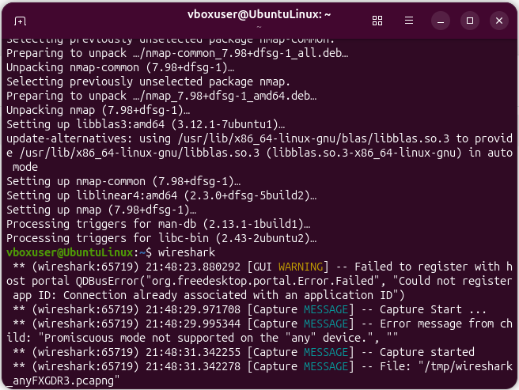
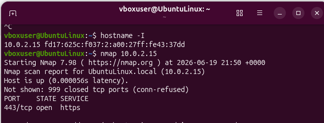
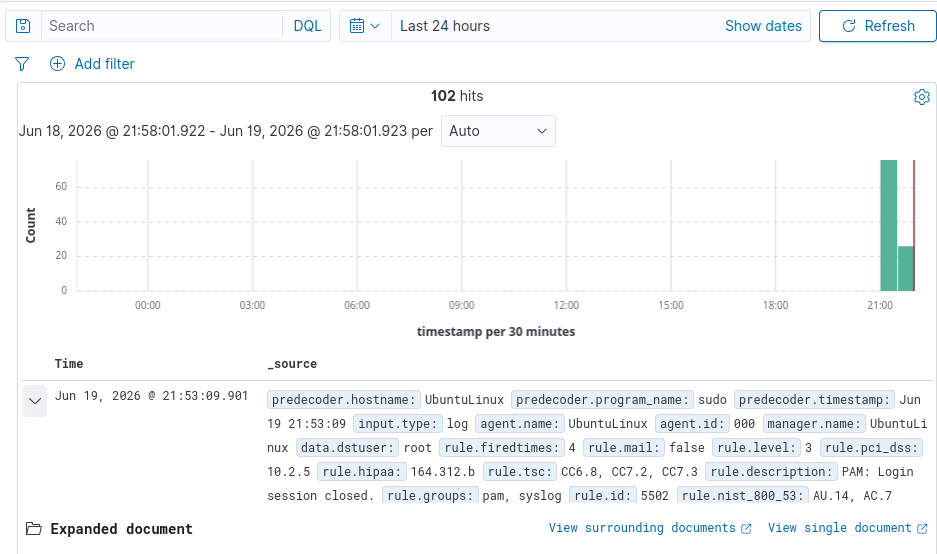
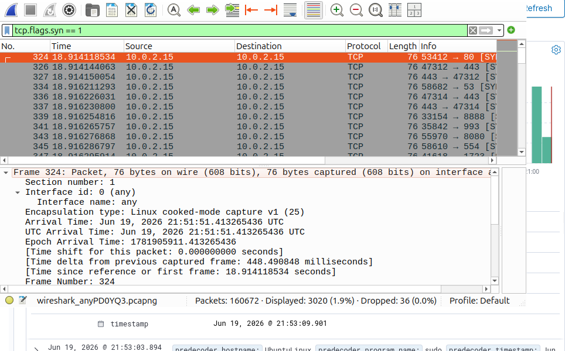

# Threat Hunting Port Scan Lab

## Overview

This lab demonstrates the detection and analysis of network reconnaissance activity using Nmap and Wireshark. The objective was to simulate a common attacker technique, capture the resulting network traffic, identify indicators of compromise (IOCs), and document findings from a defensive perspective.

## Objectives

* Install and configure Wireshark for packet capture.
* Use Nmap to perform network service discovery.
* Capture and analyze traffic generated during a port scan.
* Identify TCP SYN packets associated with reconnaissance activity.
* Document findings and map activity to the MITRE ATT&CK framework.

## Tools Used

* Ubuntu Linux
* Wireshark
* Nmap

## Lab Setup

| Device    | Purpose                             |
| --------- | ----------------------------------- |
| Ubuntu VM | Target and analysis workstation     |
| Nmap      | Network scanning and reconnaissance |
| Wireshark | Packet capture and traffic analysis |

---

## Step 1: Identify Target IP Address

The target system IP address was identified using:

```bash
hostname -I
```

### Screenshot



---

## Step 2: Perform Basic Network Scan

A basic Nmap scan was executed against the target host.

```bash
nmap <TARGET-IP>
```

Purpose:

* Discover open ports
* Identify accessible services
* Simulate attacker reconnaissance

### Screenshot



---

## Step 3: Perform TCP SYN Scan

A TCP SYN scan was executed to generate additional reconnaissance traffic.

```bash
sudo nmap -sS -T4 <TARGET-IP>
```

### Command Breakdown

* `sudo` – Run with elevated privileges
* `nmap` – Network Mapper
* `-sS` – TCP SYN Scan
* `-T4` – Aggressive timing template

Purpose:

* Simulate a common attacker scanning technique
* Generate network traffic for analysis

### Screenshot


---

## Step 4: Capture Traffic with Wireshark

Wireshark was used to capture traffic generated during the scan.

Purpose:

* Observe network communications
* Analyze packet behavior
* Investigate reconnaissance activity

### Screenshot



---

## Step 5: Filter TCP SYN Packets

The following display filter was used:

```text
tcp.flags.syn == 1
```

Purpose:

* Isolate packets associated with connection attempts
* Identify scanning behavior

---

## Step 6: Packet Analysis

Individual packets were examined to identify:

* Source IP Address
* Destination IP Address
* Destination Ports
* TCP Flags
* Connection Attempts

---

## Indicators of Compromise (IOCs)

| IOC Type       | Value                     |
| -------------- | ------------------------- |
| Source IP      | 10.0.2.15                 |
| Destination IP | 10.0.2.15                 |
| Protocol       | TCP                       |
| Activity       | Network Service Discovery |
| Tool Observed  | Nmap                      |

---

## Findings

The Nmap scan generated multiple TCP SYN packets targeting various ports on the host system. Wireshark successfully captured the traffic and allowed for identification of the reconnaissance activity. Packet analysis confirmed that the traffic was consistent with network service discovery techniques commonly used during the reconnaissance phase of an attack.

No unauthorized access was observed during testing. Activity was generated in a controlled lab environment for educational purposes.

---

## MITRE ATT&CK Mapping

### T1046 - Network Service Discovery

Description:
Adversaries may attempt to gather information about available network services to identify potential targets and attack paths.

Observed Activity:

* Port scanning
* Service discovery
* TCP SYN packet generation

---

## Skills Demonstrated

* Network Traffic Analysis
* Packet Inspection
* Threat Hunting
* Incident Documentation
* Nmap Usage
* Wireshark Analysis
* TCP/IP Fundamentals
* Security Monitoring
* Reconnaissance Detection
* MITRE ATT&CK Mapping

---

## Conclusion

This lab demonstrated the use of Wireshark and Nmap to detect and analyze network reconnaissance activity. Through packet inspection and traffic analysis, suspicious behavior was identified, documented, and mapped to the MITRE ATT&CK framework. This exercise provided practical experience with threat hunting methodologies and network security monitoring techniques.
